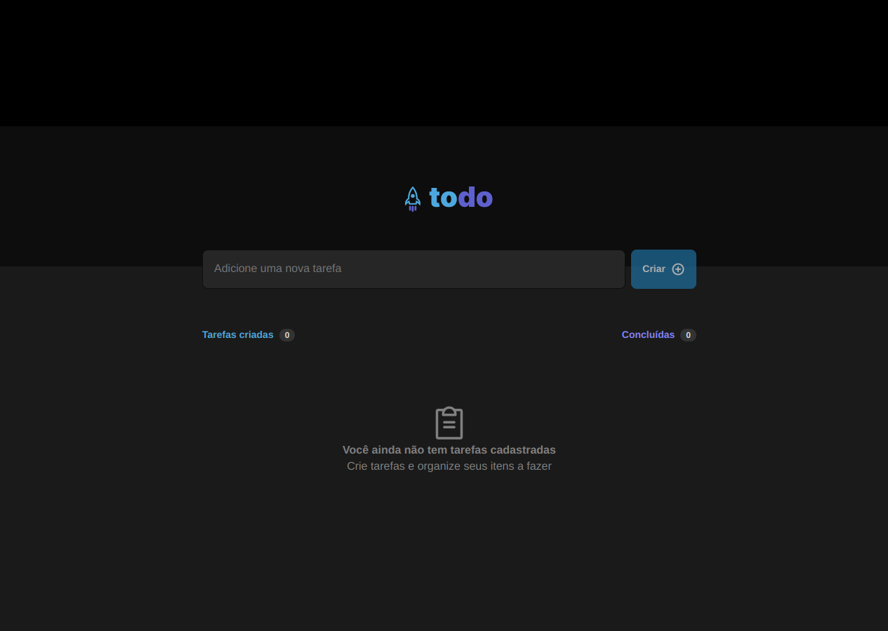
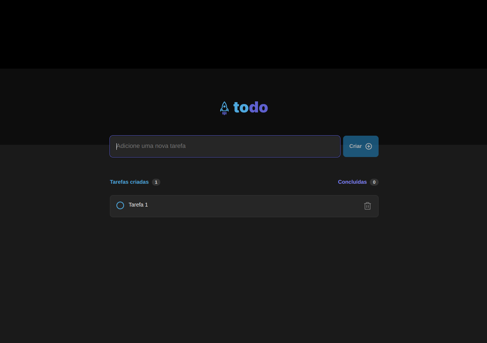
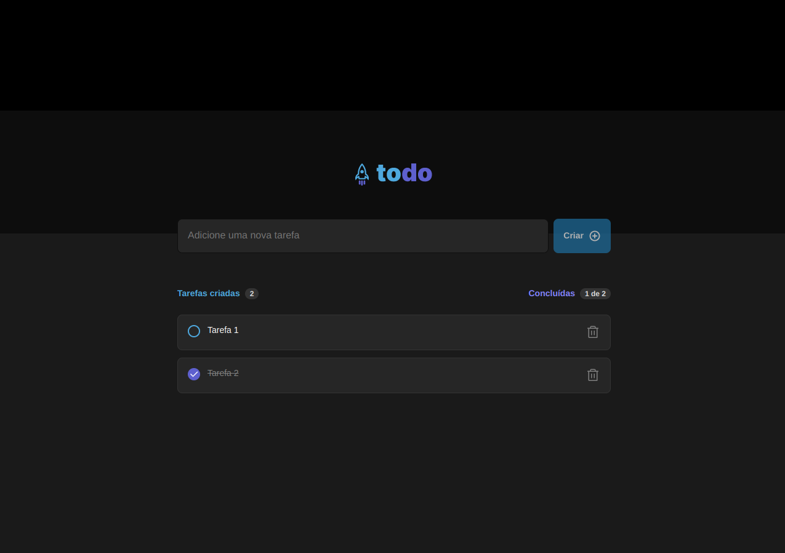

# ToDo List

## 📌 Sobre o desafio

  Desenvolver uma aplicação de controle de tarefas no estilo to-do list;

## ⚒ Funcionalidades

  - [x] - Adicionar uma tarefa;
  
  - [x] - Marcar e desmarcar uma tarefa como concluída;

  - [x] - Remover uma tarefa da listagem;

  - [x] - Mostrar o progresso de conclusão das tarefas;

## :camera: Screenshots

  
  
  

